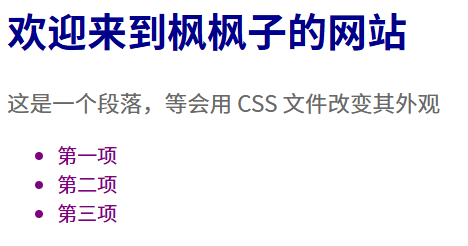

# 什么是 CSS？

CSS 是 **Cascading Style Sheets** 的缩写，中文意思是“**层叠样式表**”。

- **样式表 (Style Sheets)**：顾名思义，它的作用就是定义“样式”。比如，一个标题是什么颜色、多大字号；一个段落的行间距是多少；一张图片应该显示在左边还是右边。
- **层叠 (Cascading)**：这是一个核心概念。它指的是当有多个样式规则应用到同一个元素上时，浏览器会根据一套规则，来决定哪个样式最终生效。就像瀑布一样，样式会一层一层地应用下来。

**核心思想**：**将内容（HTML）与表现（CSS）分离**。这让你的代码更干净、更容易维护。你可以只修改一个 CSS 文件，就能改变整个网站的外观，而无需触碰任何 HTML 代码。

---
### 如何在 HTML 中使用 CSS？

有三种方式可以将 CSS 应用到你的 HTML 文档中，我们从最简单但**不推荐**的方式开始，最后介绍**最佳实践**。

#### 1. 内联样式 (Inline Styles) - 不推荐

你可以直接在 HTML 标签上使用 `style` **属性**来添加样式。

**优点**：快速、直接，适合测试或只针对单个元素的微调。 **缺点**：将样式和结构混在一起，违背了分离原则，非常难以维护。

```HTML
<h1 style="color: blue;">这是一个蓝色的标题</h1>
<p style="color: gray; font-size: 14px;">这是一个灰色、14像素大小的段落。</p>
```

####  2. 内部样式表 (Internal Style Sheet) - 适合单页

你可以在 HTML 文档的 `<head>` 部分使用 `<style>` **标签**来编写 CSS。

**优点**：样式和结构分离，所有样式集中在文件头部，易于管理。 **缺点**：这些样式只对当前这一个 HTML 文件生效，无法被网站的其他页面复用。

```HTML
<!DOCTYPE html>
<html>
<head>
  <title>内部样式表示例</title>
  <style>
    h1 {
      color: blue;
    }
    p {
      color: gray;
      font-size: 14px;
    }
  </style>
</head>
<body>

  <h1>这是一个标题</h1>
  <p>这是一个段落。</p>

</body>
</html>
```

#### 3. 外部样式表 (External Style Sheet) - 最佳实践

这是最常用、也是最推荐的方式。你需要：

1. 创建一个新的文件，以 `.css` 结尾（例如 `style.css`）。
2. 将所有的 CSS 代码写在这个文件里。
3. 在 HTML 文件的 `<head>` 部分，使用 `<link>` 标签来引入这个 CSS 文件。

**优点**：

- **完全分离**：HTML 和 CSS 在不同的文件中。
- **可重用**：同一个 `style.css` 文件可以被网站中的任意多个页面链接使用，保证了网站风格的统一。
- **易于维护**：想修改样式，只需要找到对应的 CSS 文件即可。

**示例代码：**

- `index.html`
```HTML
<!DOCTYPE html>
<html>
<head>
  <title>外部样式表示例</title>
  <link rel="stylesheet" href="style.css">
</head>
<body>

  <h1>这是一个标题</h1>
  <p>这是一个段落。</p>
  <p>这是另一个段落，它也会应用同样的样式。</p>

</body>
</html>
```
- `<link rel="stylesheet" href="style.css">` 这行代码告诉浏览器：“请加载并使用 `style.css` 这个文件来作为本页面的样式表”。

**第 2 步: 创建 `style.css` (和 `index.html` 放在同一个文件夹)**
- `style.css`
```CSS
h1 {
  color: blue;
}

p {
  color: gray;
  font-size: 14px;
}
```

---
### CSS 的基本语法：规则 (Rule)

CSS 的核心就是一套“规则”。每一条规则都包含两个主要部分：

1. **选择器 (Selector)**：它告诉浏览器，你要为**哪个** HTML 元素设置样式。
2. **声明块 (Declaration Block)**：它告诉浏览器，要设置**什么样的**样式。

我们来看一个具体的例子：

```CSS
p {
  color: green;
  font-size: 16px;
}
```

让我们分解这个规则：

- **`p`**：这就是**选择器**。它选中了页面上所有的 `<p>` 元素。
    
- **`{ ... }`**：包裹在花括号里的所有内容，就是**声明块**。
    
- **`color: green;`**：这是一个**声明 (Declaration)**。
    - `color` 是**属性 (Property)**，代表你想改变的样式特征（文本颜色）。
    - `green` 是**值 (Value)**，代表你想设置的具体样式。
    - 属性和值之间用**冒号 (`:`)** 分隔。
    - 声明的末尾用**分号 (`;`)** 结束，这非常重要，它用来分隔多个声明。
- **`font-size: 16px;`**：这是第二条声明。
    - `font-size` 是**属性**（字体大小）。
    - `16px` 是**值**（16像素）。

**总结一下语法结构：**

```
选择器 {
  属性1: 值1;
  属性2: 值2;
}
```
### 第一步：改变颜色和字体大小

现在，我们来动手实践一下。我们将使用之前学过的**外部样式表**方法。

**第 1 步: 创建 HTML 文件 (`index.html`)**

这个文件里有标题、段落和列表。

- `index.html`
```HTML
<!DOCTYPE html>
<html>
    <head>
        <title>枫枫子的网站</title>
        <link rel="stylesheet" href="style.css">
    </head>
    <body>
        <h1>欢迎来到枫枫子的网站</h1>
  
        <p>这是一个段落，等会用 CSS 文件改变其外观</p>

        <ul>
            <li>第一项</li>
            <li>第二项</li>
            <li>第三项</li>
        </ul>

    </body>
</html>
```

**第 2 步: 创建 CSS 文件 (`style.css`)**

在和 `index.html` 相同的文件夹里，创建 `style.css` 文件。

- `style.css`
```CSS
h1 {
    color : darkblue; /* 标题颜色设为深蓝色 */
}

p {
    color :dimgray; /* 段落文字颜色设为暗灰色 */
    font-size: 18px; /* 段落字体大小设为18像素 */
}

li {
    color: purple; /* 列表项颜色设为紫色 */
}
```

**第 3 步: 在浏览器中打开 `index.html`**

当你打开 `index.html` 后，你会发现：

- 标题变成了深蓝色。
- 段落文字变成了深灰色，而且比默认的要大一点。
- 列表里的每个项目都变成了紫色。

这就是 CSS 的魔力！你没有修改任何 HTML，只通过一个外部的 `style.css` 文件，就控制了整个页面的外观。

到目前为止，我们使用的**标签选择器**（如 `h1`, `p`）会一次性选中页面上**所有**的同类标签。但这在实际开发中是远远不够的。

**问题**：如果我想让页面上**只有一个**段落是红色的警告信息，而其他段落保持灰色，该怎么办？

为了解决这个问题，我们需要更精确的选择器。这就是 **类 (Class)** 和 **ID** 发挥作用的地方。

---
### 第二步：类选择器 (Class Selector) 和 ID 选择器 (ID Selector)

#### 类选择器 (`.classname`)

你可以把“类”想象成一个**标签**或**分类名**。你可以给一个或多个 HTML 元素贴上同一个“标签”，然后专门为贴有这个标签的元素设置样式。

- **HTML 中**: 使用 `class` 属性来给元素分配一个类名。
- **CSS 中**: 在类名前加上一个**点 (`.`)** 来选中它们。

**示例：**

假设我们想创建一个“警告”样式，让文字变成红色。

**HTML (`index.html`)**

```HTML
<p>这是一个普通的段落。</p>
<p class="warning">这是一个警告信息！</p>
<p>这是另一个普通段落。</p>
<div class="warning">这也是一个警告区域。</div>
```

- 我们给需要突出显示的 `<p>` 和 `<div>` 元素都添加了 `class="warning"`。
- 一个元素可以有多个 class，用空格隔开，例如 `class="warning important"`。

**CSS (`style.css`)**

```CSS
/* 普通段落样式 */
p {
  color: gray;
}

/* “warning”类的专属样式 */
.warning {
  color: red;
  font-weight: bold; /* font-weight: bold; 是加粗文字的 CSS 写法 */
}
```

- `.warning` 选择器会精确地选中所有 `class` 属性包含 `warning` 的元素，并将它们的文字颜色变为红色、字体加粗。
- 而没有这个 class 的 `<p>` 元素则不受影响。

**`class` 的核心优势**：**可重用**。你可以把同一个 class 应用到任意多个、任意种类的元素上。

#### ID 选择器 (`#idname`)

“ID”就像一个人的**身份证号**，它在一个页面上必须是**独一无二**的。一个 ID 名只能分配给**一个** HTML 元素。

- **HTML 中**: 使用 `id` 属性来给元素分配一个唯一的 ID。
- **CSS 中**: 在 ID 名前加上一个**井号 (`#`)** 来选中它。

**示例：**

通常，我们会给页面上结构性的、唯一的元素设置 ID，比如页面的主标题。

**HTML (`index.html`)**
```HTML
<h1 id="main-title">网站的主标题</h1>
```

**CSS (`style.css`)**
```CSS
#main-title {
  color: navy;
  text-align: center; /* text-align: center; 是让文本居中的 CSS 写法 */
  font-size: 32px;
}
```

- `#main-title` 选择器会精确地选中那个 `id` 为 `main-title` 的 `<h1>` 元素，并把它设置为海军蓝、居中显示、32像素大小。

**`id` 的核心规则**：**唯一性**。一个页面中，一个 ID 只能出现一次。

### Class vs. ID: 何时使用？

这是一个非常重要的区别：

|特性|类 (Class)|ID|
|---|---|---|
|**CSS 符号**|点 `.`|井号 `#`|
|**可重用性**|**可重用**，用于多个元素|**唯一的**，仅用于一个元素|
|**用途**|用于定义可复用的组件样式，如按钮 `.btn`、警告 `.warning`、高亮 `.highlight`|用于标识页面唯一的结构元素，如页眉 `#header`、页脚 `#footer`、主内容区 `#main-content`|
|**比喻**|汽车的型号（如“宝马X5”）|汽车的车牌号（独一无二）|

**建议**：优先使用 `class`。只有当你确定某个元素在整个页面里绝对是独一无二的时候，才考虑使用 `id`。