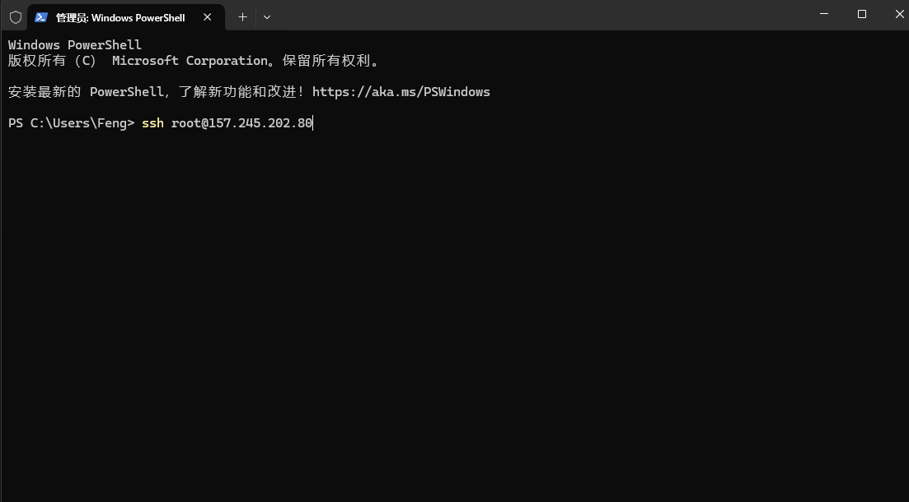
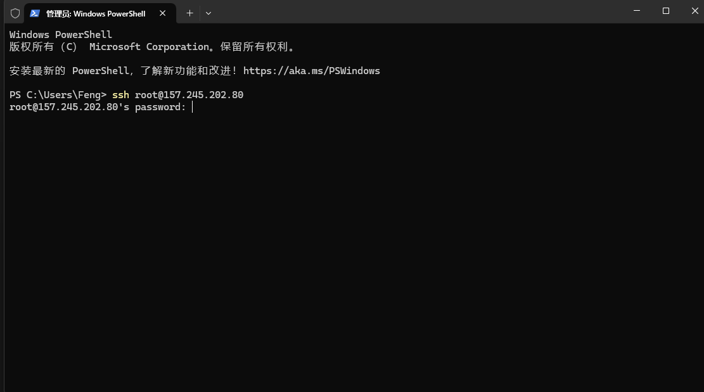
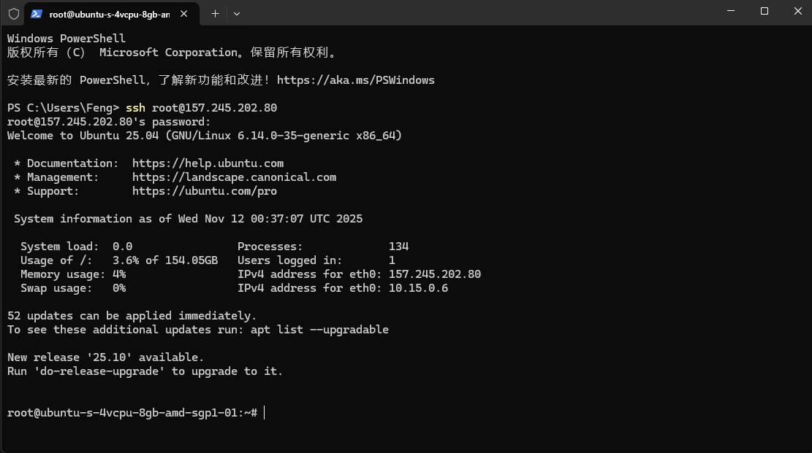
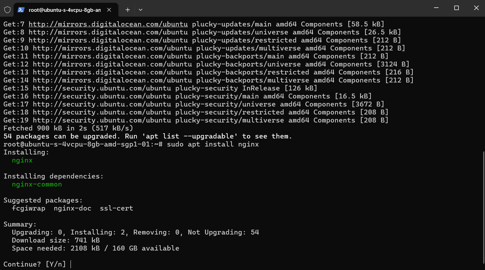
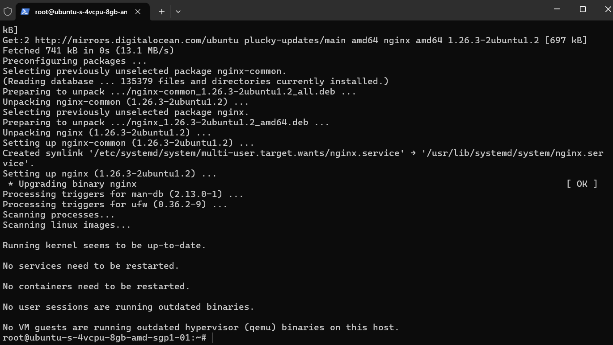

# 如何把网页挂到自己的域名

>我们在把网站挂到服务器上面，有些前置任务需要处理。
>1. **准备服务器**：安装和配置Web服务器软件（我喜欢用Nginx）。
>2. **上传网站文件**：将你的HTML、CSS、JavaScript等文件上传到服务器。
>3. **配置Nginx**：让Nginx知道你的网站文件在哪里，以及应该响应哪个域名。
>4. **配置DNS**：将你的域名指向你的服务器IP地址。
>5. **配置SSL证书**：为你的网站启用HTTPS加密。（多说一句，你每次看到网站的网址的https，这个s就可以理解为SSL证书）

---
### 第一步：安装和配置Nginx Web服务器

首先，你需要一个Web服务器软件来处理HTTP请求并提供你的网页。我通常都使用 Nginx 这个软件，对新手比较友好。

#### 1. **连接到 Ubuntu 服务器** 

>我们一般使用 SSH 协议连接到 Web 服务器。

- 打开终端，输入：
```bash
ssh 用户名@服务器ip地址
```



- 然后回车，如果是第一次连接服务器，他会提示你接不接受服务器端的 SSH 指纹，选同意即可。
- 然后会提示你输入密码，**注意，你输入的密码是看不见的，不要认为没有输进去，屏幕上不会显示你输入的密码**。



- 输入密码后回车，你会看到



- 这就说明成功连接到云端服务器了！！

#### 2.更新软件包列表并安装Nginx
> 这里就涉及到一些基本的 Ubuntu 的命令了，也是比较常用的，我觉得有必要记一下。

- 在终端里面输入：

```bash
sudo apt update
#用来获取软件包更新
sudo apt install nginx
#安装Nginx
```

- **这里你如果不是管理员用户会提示你输入密码**



- Ubuntu 会自动帮你安装软件所需的依赖，你输入 Y 即可。



- 看到这里就说明 Nginx 安装完成。